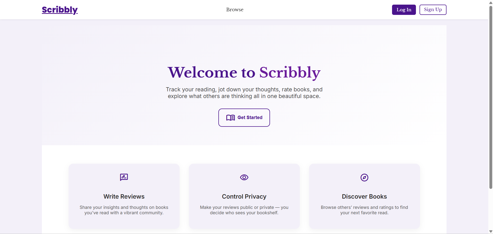
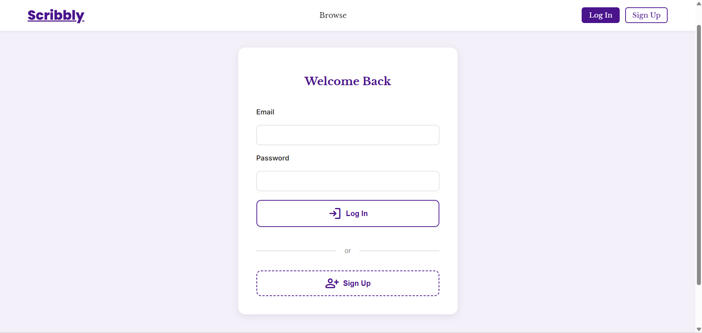
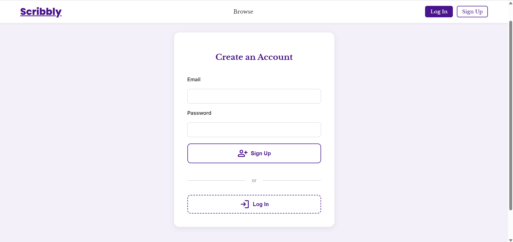
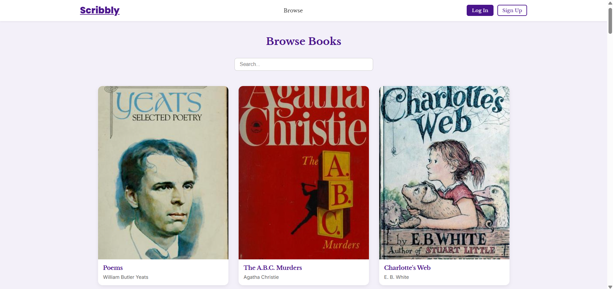

# 📚 Scribbly – Your Personal & Social Reading Companion
Deployed at: [Scribbly](https://scribbly-79jq.onrender.com/)
Scribbly is a modern, responsive book management and review platform. Whether you're a casual reader or a book enthusiast, Scribbly lets you add, rate and review books, while connecting with others through public reviews.

---

## 🖼️ Screens

### 📥 Landing Page

### 🔐 Auth Pages

### 🔍 Browse Books (via OpenLibrary)

### 🏠 Dashboard – Your Library

### 🌐 Community Reviews

---

## ✨ Features

- 📘 Add and manage your book library
- ⭐ Rate books and leave personal notes
- 🔒 Control visibility: mark reviews as Private or Public
- 🌍 Explore public reviews from the community
- 🔍 Browse books through [OpenLibrary](https://openlibrary.org/developers/api) catalog
- 🧠 Smart search across your library and public reviews
- 📱 Fully responsive with smooth animations

---

## 🧱 Architecture Overview

### 🌐 Frontend

- **React + TypeScript**  
- **CSS Modules**  
- **Framer Motion** for animations  
- **Axios** for HTTP requests  
- **Responsive layout** with grid/flex systems

### ⚙️ Backend

- **Node.js + Express**
- **MongoDB + Mongoose**
- **JWT Authentication**
- **Middleware for route protection**
- **Profanity filtering for clean reviews**

---

## 🔐 Auth & Security

- JWT-based authentication
- `requireAuth` middleware to protect API routes
- Token stored in `localStorage`, attached via Axios headers
- Duplicate review prevention (per user-title combination)

---

## 🌐 OpenLibrary API Integration

- **Search Books**: via `q` query param
- **Book Covers**: fetched using `cover_i`
- **Browse Page**: displays curated results when searched

---

## ⚠️ Error Handling

- Unified error messages for UI feedback
- Covers validation errors, API failures, and unauthorized access
- Form-level error state management

---

## 📡 API Routes

### 🔐 Auth Endpoints

| Endpoint              | Method | Description              |
|-----------------------|--------|--------------------------|
| `/api/user/signup`    | POST   | Register new user        |
| `/api/user/login`     | POST   | Login and receive token  |

### 📘 Book Endpoints (Protected)

| Endpoint                    | Method | Description                          |
|-----------------------------|--------|--------------------------------------|
| `/api/books`                | GET    | Get all books of authenticated user  |
| `/api/books/:id`            | GET    | Get single book by ID                |
| `/api/books`                | POST   | Add a new book                       |
| `/api/books/:id`            | DELETE | Delete a book                        |
| `/api/books/:id`            | PATCH  | Update a book                        |
| `/api/books/public`         | GET    | Get all public books & reviews       |

---

## 🧑‍💻 Contributing

Contributions are welcome! Feel free to:

- Fork the repository
- Submit issues or bugs
- Create pull requests with improvements or new features

---

## 📄 License

Licensed under the [Apache License 2.0](http://www.apache.org/licenses/LICENSE-2.0).
