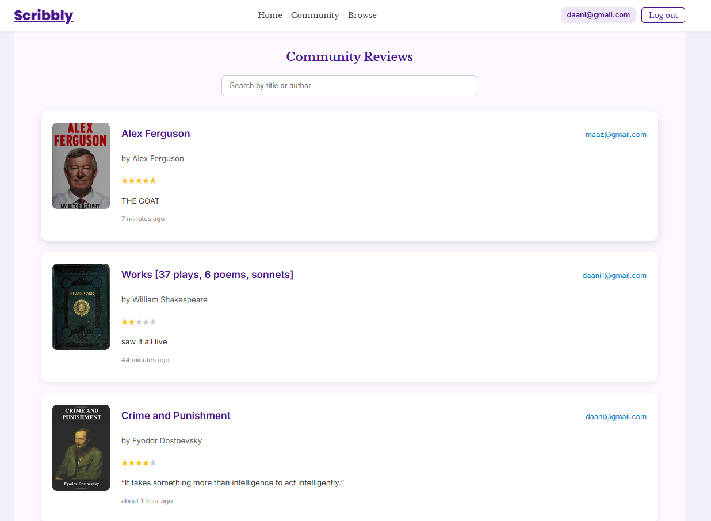

# 📚 Scribbly – Your Personal & Social Reading Companion

## ✨ Features

- 📥 Add and review books (with cover, rating and personal notes)
- 🌍 Choose visibility: Private or Public
- 📜 View public reviews from other users (Community page)
- 🔍 Browse & search through OpenLibrary catalog
- 🎯 Search through public reviews and personal library
- 🎨 Fully responsive, design with animations

---

## 🛠️ Tech Stack

### 💻 Frontend

- React + TypeScript
- CSS Modules
- Framer Motion (animations)
- OpenLibrary API integration

### 🌐 Backend

- Node.js + Express
- MongoDB + Mongoose
- JWT Auth + Middleware
- Profanity filtering

---

## 📱 Responsive Design

Fully mobile-optimized layouts with:

- 3-column grid on desktop
- 1–2 columns on tablet/mobile
- Scroll-based animations

---

## 🔒 Authentication & Authorization

- Signup/Login uses JWT tokens
- `requireAuth` middleware guards all routes
- Tokens stored in `localStorage` and injected via Axios headers

---

## 🚧 Error Handling

- All API requests provide proper error feedback
- Reused error state for both UI and form actions
- Book duplication check based on title + user

---

## 💬 Community Review Display

Each public review includes:

- User’s email
- Book title, author and cover
- Review notes
- Rating displayed via stars
- Time since review creation

---

## 🌐 OpenLibrary API Integration

Used to power:

- Book search via `q` query
- Image covers via `cover_i`
- Browse page 

---

## ✅ Screens

### 🔐 Auth Pages  
  

### 📚 Personal Dashboard  

### 🔍 Browse Books  

### 🌐 Community Reviews  

## 📡 API Overview

### 🔐 Auth Routes

| Endpoint              | Method | Description              |
|-----------------------|--------|--------------------------|
| `/api/user/signup`    | POST   | Register new user        |
| `/api/user/login`     | POST   | Login and receive token  |

### 📘 Book Routes (Protected)

| Endpoint                    | Method | Description                          |
|-----------------------------|--------|--------------------------------------|
| `/api/books`                | GET    | Get all books of authenticated user  |
| `/api/books/:id`            | GET    | Get single book by ID                |
| `/api/books`                | POST   | Add a new book                       |
| `/api/books/:id`            | DELETE | Delete a book                        |
| `/api/books/:id`            | PATCH  | Update a book                        |
| `/api/books/public`         | GET    | Get all public books & reviews       |

---

## 🤝 Contributing

Feel free to fork this repo, create issues, or submit PRs. Bug fixes, improvements, and features are always welcome.

---

## 📄 License

## 📄 License

This project is licensed under the [Apache License 2.0](http://www.apache.org/licenses/LICENSE-2.0).